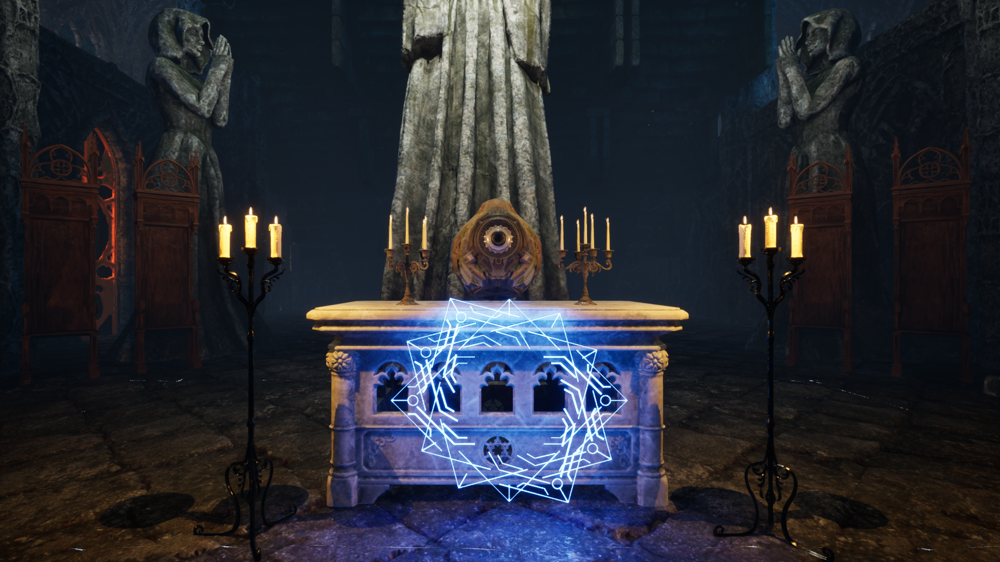
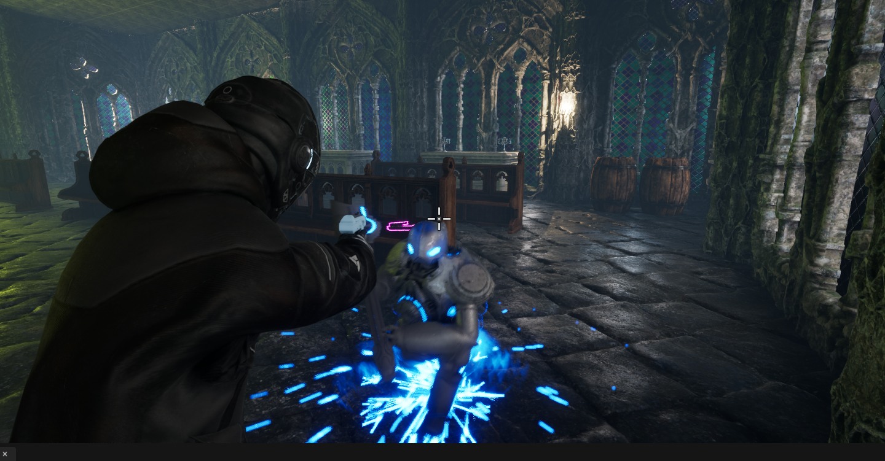
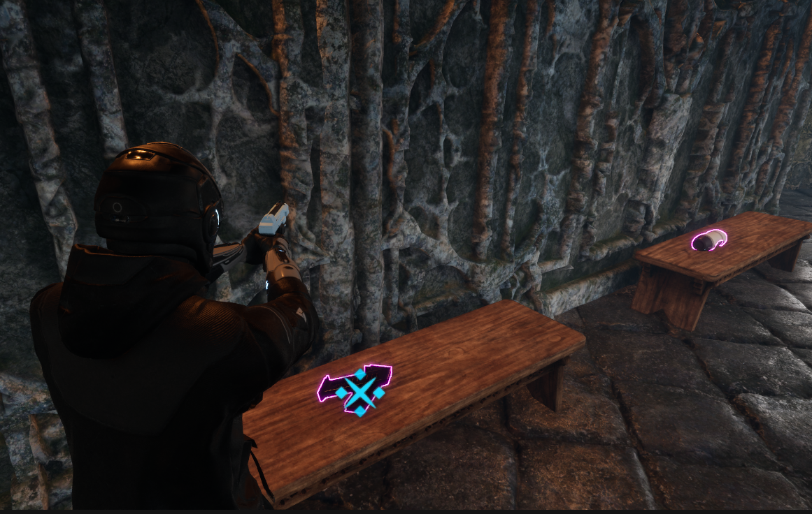
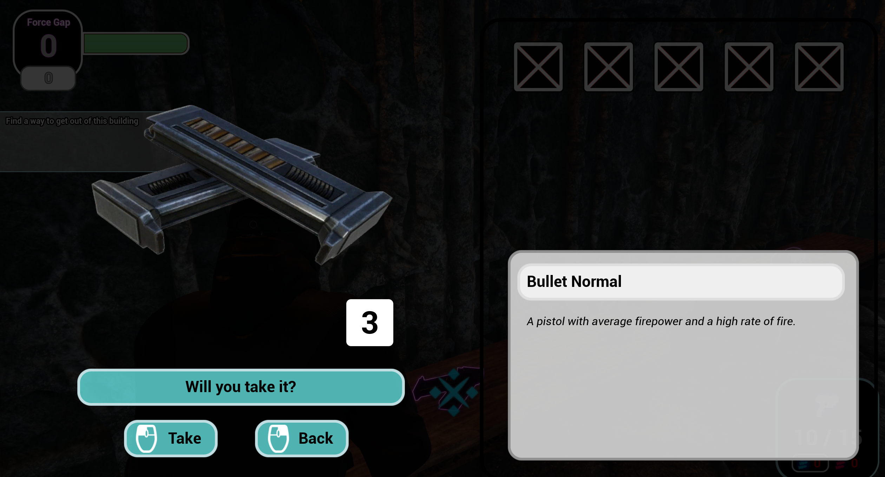
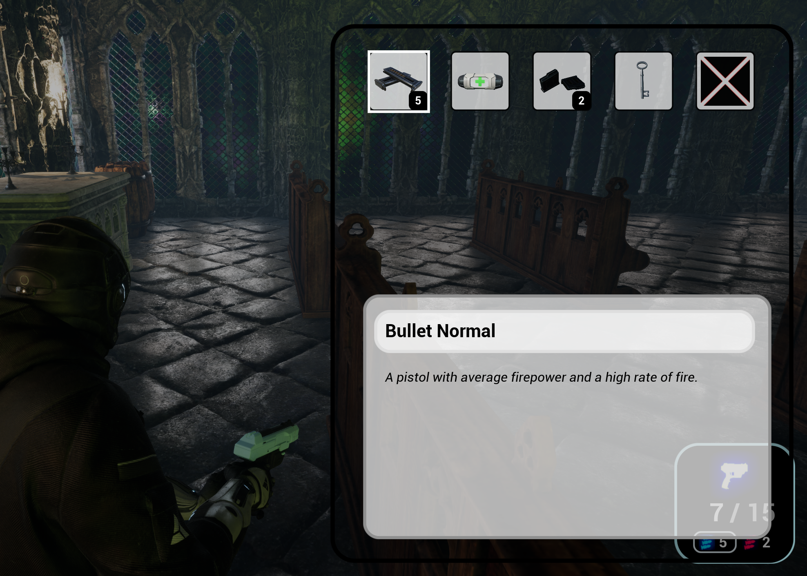
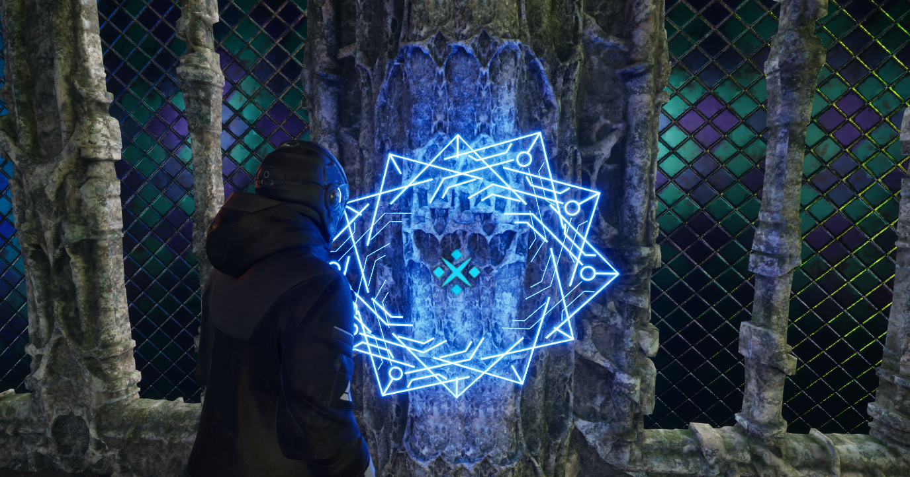

# PeacefulHazard

About This Game
This is a survival adventure game inspired by Resident Evil 2, but without the horror element.

The player receives a mission to find treasure, exploring vast stages, solving puzzles, and either avoiding or defeating enemies while trying to escape.

Strategic gameplay is required due to the limited resources and inventory system, offering tension and a sense of challenge without relying on fear.

**Key Features**

**Puzzle Solving and Treasure Hunting:**

Players must find hidden treasures and solve puzzles across various stages, with the ultimate goal of escaping.

**Combat or Avoidance:**

Throughout the stages, players encounter enemies that can either be defeated or avoided, depending on the situation.

**Limited Resources:**

The number of consumable items, such as bullets, keys, and healing items, is limited, making efficient resource management essential.

**Inventory Management:**

With limited inventory space, players must selectively carry important items, and these choices have a significant impact on the game's progression.

**Messages from Predecessor Agents:**

Scattered across the map are tips left by previous agents. Reading and using this information can be helpful during gameplay.
