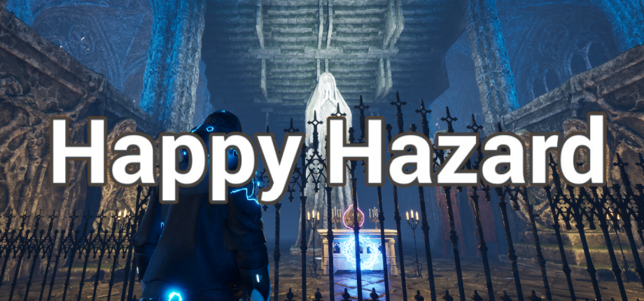

# PeacefulHazard: Happy Hazard

---

## About This Game
**PeacefulHazard** is a survival adventure game inspired by *Resident Evil 2*—without the horror. 

The player embarks on a mission to search vast stages for hidden treasures, solve intricate puzzles, and navigate around or confront enemies, all while managing limited resources and inventory space. The game focuses on strategic gameplay, tension, and a sense of challenge, offering engaging mechanics without relying on fear.

---

## Key Features

### Puzzle Solving and Treasure Hunting

Vast stages await exploration where players must solve puzzles to discover hidden treasures. The ultimate objective? Solve the puzzles, find the treasures, and escape.

---

### Combat or Avoidance

Face enemies head-on or choose to avoid them. Each encounter presents a choice that can affect your resources and progress.

---

### Limited Resources

Consumable items like bullets, keys, and healing supplies are scarce. Effective resource management becomes crucial to your survival.

---

### Inventory Management

Players have limited inventory space, requiring them to make critical decisions on what to carry. Choosing the right items will be key to advancing through the game.

---

### Messages from Predecessor Agents

Discover hints and tips left by previous agents across the map. These clues can provide valuable insights and help you overcome challenges.

---

## Game Trailer GIFS

### 1. Explore the Area

### 2. Battle With Enemies

### 3. Get Item and Solve Puzzles

### 4. Manage Your Inventory and Expand It

### 5. Get Treasure and Complete Mission

